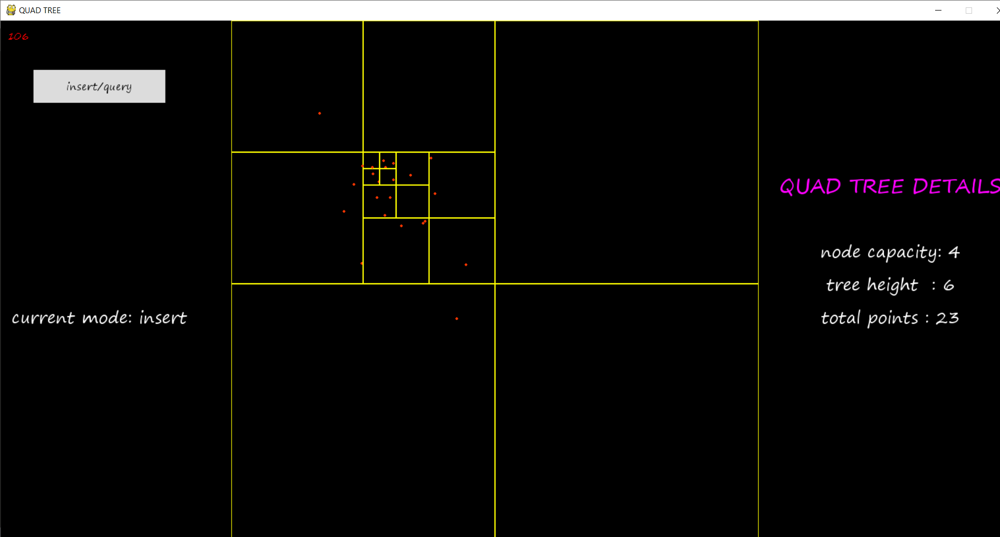
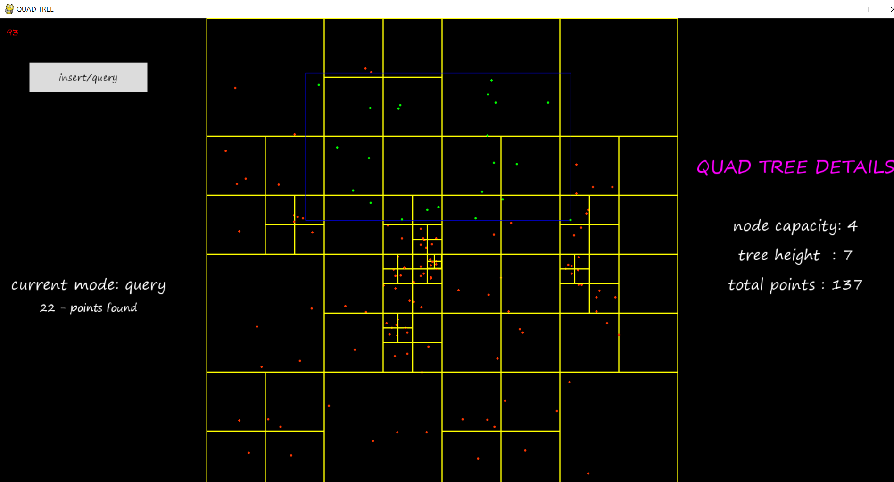
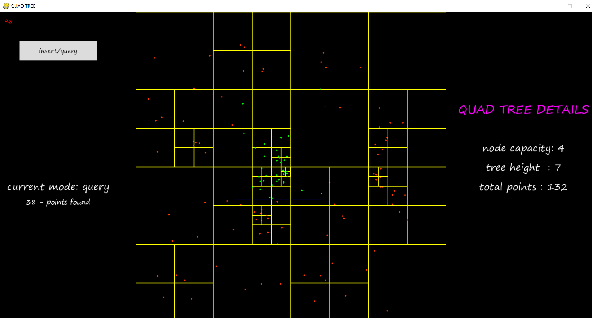

# quad-tree
A quadtree is a tree data structure in which each internal node has exactly four children. Quadtrees are the two-dimensional analog of octrees and are most often used to partition a two-dimensional space by recursively subdividing it into four quadrants or regions. The data associated with a leaf cell varies by application, but the leaf cell represents a "unit of interesting spatial information".

#### features:
###### 1.They decompose space into adaptable cells.
###### 2.Each cell (or bucket) has a maximum capacity. When maximum capacity is reached, the bucket splits.
###### 3.The tree directory follows the spatial decomposition of the quadtree.

### Types:
1.Region quadtree  
2.Point quadtree   
3.PR quadtree   
4.Edge quadtree  
5.PM quadtree  

### Some common uses of quadtrees
1. Image representation
2. Bitmap and its compressed quadtree representation
3. Image processing
4. Mesh generation
5. Spatial indexing, point location queries, and range queries
6. Efficient collision detection in two dimensions
7. View frustum culling of terrain data
8. Storing sparse data, such as a formatting information for a spreadsheet or for some matrix calculations 
9. Solution of multidimensional fields (computational fluid dynamics, electromagnetism).
10. Conway's game of life simulation program.
11. State estimation
12. Fractal image analysis
13. Maximum disjoint set

## Installation
clone this repository and execute the following commands:
   ##### to install requirements:
          pip install -r requirements.txt 
   ##### to try the code:
          python main.py
   Note:
      insert/query button switches mode b/n insert mode and query mode.
   1. insert mode: click to insert node at that position.
   2. query mode : click two points(topleft and bottomright of query rectangle).   
     
   ##### to use quadtree in other projects:
          import quadtree
          
## screen-shots

